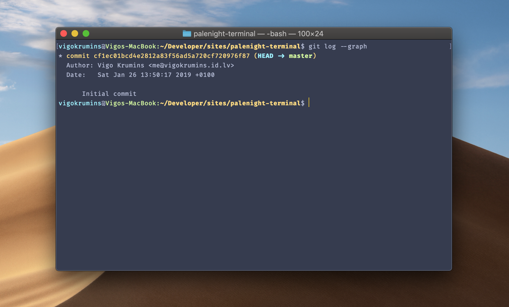

# Material Theme Palenight – Terminal


* [Overview](#Overview)
* [Requirments](#Requirments)
* [Recommended](#Recommended)
* [Installation](#Installation)
* [Issues](#Issues)
* [Credits](#Credits)
* [License](#License)

## Overview
This is a Material Theme Palenight for macOS Terminal app.

## Requirments
* [Fira Code](https://github.com/tonsky/FiraCode) – Monospaced font with programming ligatures.

## Recommended
It's recommended to modify Bash prompt and enable colors.

* Open Terminal and type `nano ~/.bash_profile`.
* Paste the following lines:
```bash
export CLICOLOR=1
export LSCOLORS=GxFxCxDxBxegedabagaced
export PS1="\[\033[36m\]\u\[\033[m\]@\[\033[32m\]\h:\[\033[33;1m\]\w\[\033[m\]\$ "
```
* Hit CTRL+O to save, then CTRL+X to exit nano.

This will enable colors for your Terminal and rearrange the prompt to be `username@hostname:cwd $`.

## Installation
1. Download [palenight-terminal.terminal](./palenight-terminal.terminal) file.
2. Open Terminal.
3. Select `Terminal` -> `Preferences...` or press `CMD+,` (CMD + comma).
4. Navigate to `Profiles` tab.
5. Click the `gear` icon.
6. Click `Import...` and select [palenight-terminal.terminal](./palenight-terminal.terminal) file.
7. Select [palenight-terminal](./palenight-terminal.terminal) theme and click `Default` to set it as a default theme.

## Issues
Any issues report here, at the [GitHub repo](https://github.com/VigoKrumins/palenight-terminal/issues).

## Credits
This theme is based on VS Code [Material Theme](https://github.com/equinusocio/vsc-material-theme) by [Mattia Astorino](https://github.com/equinusocio).

## License
The license can be found in [LICENSE](./LICENSE) file.
